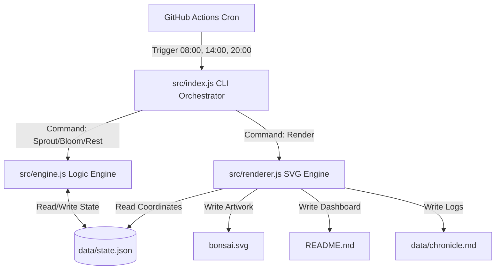

# Project Yggdrasil: Architecture & Technical Documentation

This document provides a comprehensive overview of the design, architecture, and logic behind **Project Yggdrasil**, the living contribution graph system. This is intended to serve as reference material for technical interviews or portfolio deep-dives.

## 1. Executive Summary
Project Yggdrasil is a purely deterministic, zero-dependency Node.js algorithmic tree generator. The goal of the project is to create a true "living repository" that maintains an active GitHub Contribution Graph by generating meaningful, stateful, and non-repetitive artwork daily. 

Instead of relying on meaningless string mutations or empty commits, the system simulates a 2D digital ecosystem (a forest) that physically grows over time and generates its own UI (`bonsai.svg` and `README.md`) through scheduled GitHub Actions.

## 2. System Architecture

The ecosystem relies on an **Orchestrator Pattern**, cleanly separating the generation logic, the rendering engine, and the data layer.



## 3. The Core Ecosystem Engine (`src/engine.js`)

Unlike standard recursive L-Systems (which grow exponentially and can lead to gigabyte-sized files within a few weeks), Yggdrasil utilizes a **Stochastic Branching Algorithm** to maintain computational efficiency while appearing highly organic.

### State Persistence
The system is entirely stateless in memory; the "genome" and coordinates of the trees are persisted in `data/state.json`.

```json
{
  "day": 8,
  "trees": [
    {
      "active": true,
      "branches": [
        { "x1": 500, "y1": 1000, "x2": 500, "y2": 850, "angle": 0, "active": false }
      ],
      "leaves": []
    }
  ],
  "logs": []
}
```

### Growth Mechanics (The "Sprout" Phase)
Executed every morning, the algorithm iterates through `active` branches:
1. **Depth Limits:** If a branch reaches a maximum depth (e.g., 10 iterations) or fails a random 10% death check, it becomes `active: false`.
2. **Forking:** The branch stops growing, and creates either 1 or 2 new child branches (`active: true`) originating from its `(x2, y2)` end-coordinates.
3. **Angles:** Uses basic Trigonometric projections: 
   `x = prev_x + length * sin(angle)`
   `y = prev_y - length * cos(angle)`
4. **Forest Scaling:** Once a tree has 0 active branches (it has fully matured), the engine drops a "seed" at a new random X-coordinate, beginning the lifecycle of a brand new tree the next day.

### Foliage Mechanics (The "Bloom" Phase)
Executed midday, the algorithm searches for mature branches (`depth > 4`) and probabilistically adds colored leaf/blossom nodes with random radii. The palette is weighted towards greens but includes rare chances for pink/gold blossoms.

## 4. The Rendering Engine (`src/renderer.js`)

Generating images programmatically inside CI/CD pipelines usually requires heavy libraries like `canvas` or Python's `matplotlib`. To ensure 100% reliability and speed (free tier Actions), the renderer manually constructs an XML/SVG `<svg>` tree out of raw strings.

> [!TIP]
> **Performance Edge:** Because the SVG is constructed using string interpolation in raw Node.js, the entire workflow executes in **~2-3 seconds**, consuming virtually zero GitHub Actions compute minutes.

- **Responsive & Dynamic:** Uses basic `<line>` and `<circle>` SVG primitives mapping perfectly to the `state.json` geometric coordinates. 
- **Premium Aesthetics:** Employs CSS/SVG `<filter>` chains to create a soft bloom/glow effect (`feGaussianBlur` + `feComposite`) to give the artwork a magical, neon aesthetic in dark mode.

## 5. Automation Strategy (The "2-3 Daily Commits" Guarantee)

The single hardest requirement of the brief was "no missed days." Relying on a single cron job is dangerous (if GitHub's cron delays, a day can be skipped according to UTC timezone shifts). 

**Mitigation:** The system uses three distinct GitHub `.yml` workflows firing at three widely separated UTC hours.
- **Morning Sprout (08:00):** Guaranteed structural growth diff.
- **Midday Bloom (14:00):** Guaranteed foliage / radius diff.
- **Evening Rest (20:00):** Even if the tree is fully dormant, the `rest()` function includes micro-sway logic (slightly mutating the angles of dormant branches). This guarantees `git diff` always detects a change in the JSON coordinates, ensuring the Git Push layer never fails due to an "Empty Commit".

## 6. Future Evolutions

Because the structure is architecturally decoupled, you can easily implement the following to level-up the project in the future:
- **API Ingestion:** Modify the `engine.js` script to fetch real-world local weather data via an open API. If it's raining in your city, the renderer adds blue raindrops. 
- **Commit Intensity Tracking:** Replace the Math.random() growth factors with GraphQL queries against your actual GitHub commit counts. (High commits = fast growth).
