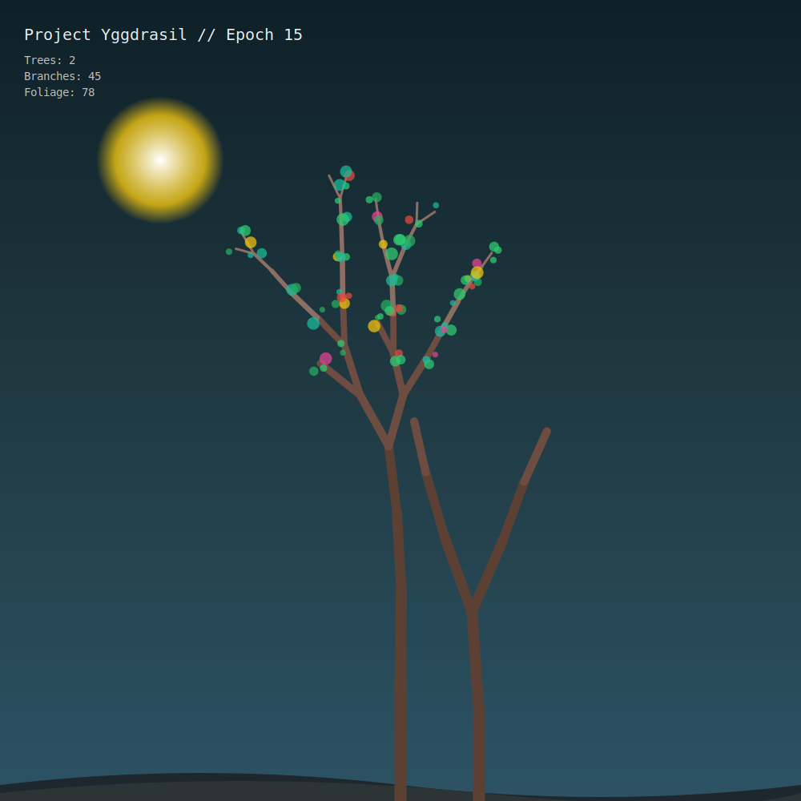

# Project Yggdrasil 🌳

> The Living Forest: A procedural digital ecosystem that evolves 3 times a day via GitHub Actions.

### 📊 Ecosystem Stats
- **Epoch (Days Alive):** 45
- **Trees Planted:** 5
- **Total Branches:** 163
- **Total Foliage:** 757

### 📖 Botanist's Log (Latest entries)
- 🌸 Midday bloom: The canopy thickened with 40 new foliage elements.
- 🍂 Day 45: A tree has reached its full majesty and stands still. 🌰 A new seed drops at x=540.
- 🌙 Evening rests the ecosystem. Day 44 comes to a close.
- 🌸 Midday bloom: The canopy thickened with 47 new foliage elements.
- 🌿 Day 44: The morning sun encourages new growth.

---
*Generated procedurally by GitHub Actions. This repository is alive.*
